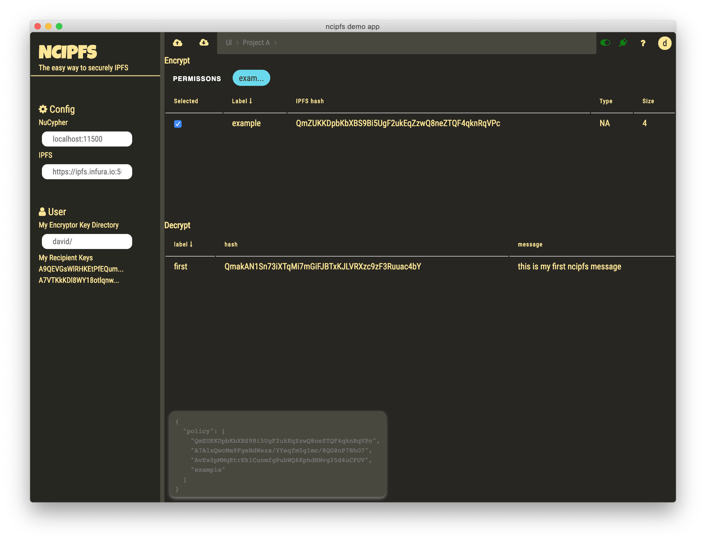
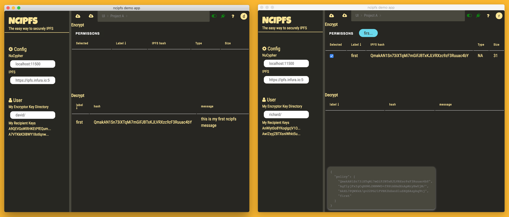

# NCIPFS


[](https://www.python.org/downloads/release/python-370/) [](https://opensource.org/licenses/MIT)


Welcome to ncipfs

this project makes it easy to secure data on IPFS with NuCyphers awesome proxy re encryption.

## Whats that mean?

Basicly this is allows devs to store data in IFPS and create access polices for arbitrary users. 

### Example:  

`David` wants to upload a 1 TB file and allow `Kathy` and `Joe` access. 

Traditionally he would ask `Kathy` and `Joe` for their respecive public keys and then he would encrypt the data twice; once for each key. Then store the encrypted value somewhere they could retrived it. He'll use IPFS as this datastore. 

However NuCyphers proxy re-encryption allows us to encrypt the data once, then re-encrypt new keys that will allow the two parties access. In this system we only encrypt the 1 TB once, and only store 1 TB on IPFS, this saves us storage space, encryption time, and ecryption computations. 

### Benefits

✅ **Y**ou **O**nly **E**ncrypt **O**nce **(Y.O.E.O kinda like Y.O.L.O)**  
✅ Verified (immutable data store)  
✅ Only re-encrypt keys for viewers  
✅ Distributed - no single point of failure  
✅ Can run federated (centralized) or distributed (ECR20 token incentivized)  

### Use cases

💡 Distributing large datasets  
💡 Distributing data to many people  
💡 IOT datastored (check out the original hearbeat example)  

### Implementations

🐥 Python 3 (stable IPFS and NuCypher codebases)  
🥚 Node JS (waiting on stable NyCypher codebase)  
🥚 Golang (waiting on stable NyCypher codebase) 

## Installation
```python
git clone https://github.com/drbh/nucypher-ipfs.git
cd nucypher-ipfs.git
```

We use `pipenv` to manage any of the deps
```
# install deps and access virtual env
pipenv install
pipenv shell
```


## Starting a local NuCypher network

```bash
git clone https://github.com/nucypher/nucypher.git
cd nucypher
pipenv install
pipenv shell
sh scripts/local_fleet/run_local_fleet.sh
```

you should see this if successful
```
Starting Local Development Fleet...
Starting Lonely Ursula...
Starting Ursula #2...
Starting Ursula #3...
```

## How to use the webapp



In order to best understand the integrations that will best help future developers, we propose a novel web app using the lower level `ncipfs library`.

The application is a data sharing program that allows a user to enter a label and file contents, this is then encrypted and stored on IPFS. Another users can share their public recipient keys and the orginator can then add permssion policies to thier encrypted file. The other user can then download this file into thier web app. 

```
python server.py 5000
```

now navigate to `localhost:5000`

here you can enter a name and it will generate both Alive and Bob charater keys for the user. It generates new Alice on each reconnect, and new Bob's when you make a new user. The Bob keys are what allow you to access files that have been shared with you. It is important they are persisted. 

now in another shell run 

```
python server.py 4999
```

and navigate to `localhost:4999`



Now you have two server running - both are acting as a different Alice+Bob pair on the locally running NuCypher network. These nodes can now pass public data between them, which will allow them to locate, download and decrypt messages stored on IPFS.

#### Alot to do!

This app is functional but not useful. It showcases the ability to wrap up `ncipfs` as a server and create a working sercure webapp. However it does not manager users well, it only sends strings (and we should be able to encrypt files in place). It does not helpt transfer the policy keys to the recpient and it needs alot of UI work. Hopefully it serves as a base place for understanding the `ncipfs` project.


## How to use as a library

If you want to use this in dev, you'll have to copy the current `ncipfs` files into your program or change the scripts directory to the projects root. This way you can import ncipfs.  

## Sender

```python
import base64
from ncipfs import main

client = main.ncipfs()
```

Connect to Urslas and IPFS Gateway - in this case we connect to two locally running instances
```python
client.connect(nucypher_network="localhost:11500",
          ipfs_api_gateway="https://ipfs.infura.io:5001")
```

Now making or loading in an identity is easy
```python
client.load_user("alice_ipfs_user/")
```

#### Securing data

we can set the label and contents easily
```python
my_label = b'ncipfs_is_awesome.txt'
my_contents = "arbitrary data that is stored on IPFS"
```

now we make a key and add the files to IPFS
```python
pubkey = client.make_key_from_label(my_label)
cid = client.add_contents(pubkey, my_contents)
```

#### Permissioning data

Now that the data is in IPFS, we'll want to permission readers access. To do so we need the recipents `enc` and `sig` keys.

For the demo purposes we'll use these pre generated ones (associated with private keys below)
```python
# DEMO PUB KEYS FOR BOB
pubs = {
    'enc_pubkey': b'A1r7sYpgXLka/PiRgmzZ6cKpzquqAAkxgJRqOkhgx8sJ',
    'sig_pubkey': b'AsKuKFMvVbhPXY73uqowmBzkx1/k+V7jDWtszdVIfjUE'
}
```

Now we can pass the public keys in to the policy creator

```python
label =my_label
m, n = 2, 3
policy = client.create_access_policy(
    enc_pubkey=base64.b64decode(pubs["enc_pubkey"]), 
    sig_pubkey=base64.b64decode(pubs["sig_pubkey"]), 
    label=label, 
    m=m, 
    n=n   
)
print(policy)
```

lastly we make the output date (ipfs hash and policy values) into a passable format.

```python
def convert_to_encoded(bs):
    return base64.b64encode(bytes.fromhex(bs))

to_send = [
    cid,
    convert_to_encoded(policy["policy_pubkey"]),
    convert_to_encoded(policy["alice_sig_pubkey"]),
    policy["label"],
]

print(to_send)
```

```python
# OUTPUT
[
	'QmZVMX9QYDur9TqsPEgXD7KjznukRHEMJR2k5dSbESo56L',
	b'AxuIyKXQlC3LeHHmIisIaibonNV6c1k4eNbLoF+1YNTz', 
	b'AhmvPLlri8wu3lRIj+KpHjd9RlUxv+vpeX0KDEZF2w6z', 
	'ncipfs_is_awesome.txt'
]
```

## Reader

#### Accessing data

```python
from ncipfs import main
from umbral.keys import UmbralPrivateKey, UmbralPublicKey
import base64

client = main.ncipfs()
client.connect(nucypher_network="localhost:11500",
          ipfs_api_gateway="https://ipfs.infura.io:5001")
```

We get the recpients identity (with their keys)
```python
# DEMO PRIV KEYS FOR BOB
priv = {
	'enc_privkey': b'aasQiCiv2uzFMVEvADPdMgB7oVbbkxtivxNk4+MCHLQ=',
	'sig_privkey': b'N/jL9tJKffa2ZGHy7WFZ+xKy9bfTXobuoxo47ZqEpVI='
}

doctor = client.load_recipent(
    UmbralPrivateKey.from_bytes(base64.b64decode(priv["enc_privkey"])),
    UmbralPrivateKey.from_bytes(base64.b64decode(priv["sig_privkey"]))
)
```

All the reader needs to access the data is to connect to the Ursula network for re encryption, and the following values (the policy + the ipfs hash)


*also above*
```python
# OUTPUT
input_data = [
    'QmZVMX9QYDur9TqsPEgXD7KjznukRHEMJR2k5dSbESo56L', 
    b'AxuIyKXQlC3LeHHmIisIaibonNV6c1k4eNbLoF+1YNTz', 
    b'AhmvPLlri8wu3lRIj+KpHjd9RlUxv+vpeX0KDEZF2w6z', 
    'ncipfs_is_awesome.txt'
]

def convert_to_decoded(b64):
    return base64.b64decode(b64)

cid = input_data[0]
policy = {
    "policy_pubkey": convert_to_decoded(input_data[1]).hex(),
    "alice_sig_pubkey": convert_to_decoded(input_data[2]).hex(),
    "label": input_data[3]
}
```

Lastly we can fetch the files and get them reencrypted for this recpeients access only!
```python
message = client.get_file_and_decrypt(doctor, policy, cid)
print(message)
```

```python
# OUTPUT
The Doctor joins policy for label 'ncipfs_is_awesome.txt'
arbitrary data that is stored on IPFS   Retrieval time:    85.02 ms
```
