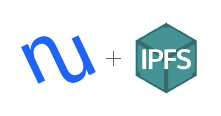

# NCIPFS




[](https://www.python.org/downloads/release/python-370/) [](https://opensource.org/licenses/MIT)


Welcome to ncipfs

this project makes it easy to secure data on IPFS with NuCyphers awesome proxy re encryption.

## Whats that mean?

Basicly this is allows devs to store data in IFPS and create access polices for arbitrary users. 

### Example:  

`David` wants to upload a 1 TB file and allow `Kathy` and `Joe` access. 

Traditionally he would ask `Kathy` and `Joe` for their respecive public keys and then he would encrypt the data twice; once for each key. Then store the encrypted value somewhere they could retrived it. He'll use IPFS as this datastore. 

However NuCyphers proxy re-encryption allows us to encrypt the data once, then re-encrypt new keys that will allow the two parties access. In this system we only encrypt the 1 TB once, and only store 1 TB on IPFS, this saves us storage space, encryption time, and ecryption computations. 

### Benefits

✅ **Y**ou **O**nly **E**ncrypt **O**nce **(Y.O.E.O kinda like Y.O.L.O)**  
✅ Verified (immutable data store)  
✅ Only re-encrypt keys for viewers  
✅ Distributed - no single point of failure  
✅ Can run federated (centralized) or distributed (ECR20 token incentivized)  

### Use cases

💡 Distributing large datasets  
💡 Distributing data to many people  
💡 IOT datastored (check out the original hearbeat example)  

### Implementations

🐥 Python 3 (stable IPFS and NuCypher codebases)  
🥚 Node JS (waiting on stable NyCypher codebase)  
🥚 Golang (waiting on stable NyCypher codebase) 

## Installation
```python
git clone https://github.com/drbh/nucypher-ipfs.git
cd nucypher-ipfs.git
```

We use `pipenv` to manage any of the deps
```
# install deps and access virtual env
pipenv install
pipenv shell
```

## How to use

If you want to use this in dev, you'll have to copy the current `ncipfs` files into your program or change the scripts directory to the projects root. This way you can import ncipfs.  

## Sender

```python
import base64
from ncipfs import main

client = main.ncipfs()
```

Connect to Urslas and IPFS Gateway - in this case we connect to two locally running instances
```python
client.connect(nucypher_network="localhost:11500",
          ipfs_api_gateway="https://ipfs.infura.io:5001")
```

Now making or loading in an identity is easy
```python
client.load_user("alice_ipfs_user/")
```

#### Securing data

we can set the label and contents easily
```python
my_label = b'ncipfs_is_awesome.txt'
my_contents = "arbitrary data that is stored on IPFS"
```

now we make a key and add the files to IPFS
```python
pubkey = client.make_key_from_label(my_label)
cid = client.add_contents(pubkey, my_contents)
```

#### Permissioning data

Now that the data is in IPFS, we'll want to permission readers access. To do so we need the recipents `enc` and `sig` keys.

For the demo purposes we'll use these pre generated ones (associated with private keys below)
```python
# DEMO PUB KEYS FOR BOB
pubs = {
    'enc_pubkey': b'A1r7sYpgXLka/PiRgmzZ6cKpzquqAAkxgJRqOkhgx8sJ',
    'sig_pubkey': b'AsKuKFMvVbhPXY73uqowmBzkx1/k+V7jDWtszdVIfjUE'
}
```

Now we can pass the public keys in to the policy creator

```python
label =my_label
m, n = 2, 3
policy = client.create_access_policy(
    enc_pubkey=base64.b64decode(pubs["enc_pubkey"]), 
    sig_pubkey=base64.b64decode(pubs["sig_pubkey"]), 
    label=label, 
    m=m, 
    n=n   
)
print(policy)
```

lastly we make the output date (ipfs hash and policy values) into a passable format.

```python
def convert_to_encoded(bs):
    return base64.b64encode(bytes.fromhex(bs))

to_send = [
    cid,
    convert_to_encoded(policy["policy_pubkey"]),
    convert_to_encoded(policy["alice_sig_pubkey"]),
    policy["label"],
]

print(to_send)
```

```python
# OUTPUT
[
	'QmZVMX9QYDur9TqsPEgXD7KjznukRHEMJR2k5dSbESo56L',
	b'AxuIyKXQlC3LeHHmIisIaibonNV6c1k4eNbLoF+1YNTz', 
	b'AhmvPLlri8wu3lRIj+KpHjd9RlUxv+vpeX0KDEZF2w6z', 
	'ncipfs_is_awesome.txt'
]
```

## Reader

#### Accessing data

```python
from ncipfs import main
from umbral.keys import UmbralPrivateKey, UmbralPublicKey
import base64

client = main.ncipfs()
client.connect(nucypher_network="localhost:11500",
          ipfs_api_gateway="https://ipfs.infura.io:5001")
```

We get the recpients identity (with their keys)
```python
# DEMO PRIV KEYS FOR BOB
priv = {
	'enc_privkey': b'aasQiCiv2uzFMVEvADPdMgB7oVbbkxtivxNk4+MCHLQ=',
	'sig_privkey': b'N/jL9tJKffa2ZGHy7WFZ+xKy9bfTXobuoxo47ZqEpVI='
}

doctor = client.load_recipent(
    UmbralPrivateKey.from_bytes(base64.b64decode(priv["enc_privkey"])),
    UmbralPrivateKey.from_bytes(base64.b64decode(priv["sig_privkey"]))
)
```

All the reader needs to access the data is to connect to the Ursula network for re encryption, and the following values (the policy + the ipfs hash)


*also above*
```python
# OUTPUT
input_data = [
    'QmZVMX9QYDur9TqsPEgXD7KjznukRHEMJR2k5dSbESo56L', 
    b'AxuIyKXQlC3LeHHmIisIaibonNV6c1k4eNbLoF+1YNTz', 
    b'AhmvPLlri8wu3lRIj+KpHjd9RlUxv+vpeX0KDEZF2w6z', 
    'ncipfs_is_awesome.txt'
]

def convert_to_decoded(b64):
    return base64.b64decode(b64)

cid = input_data[0]
policy = {
    "policy_pubkey": convert_to_decoded(input_data[1]).hex(),
    "alice_sig_pubkey": convert_to_decoded(input_data[2]).hex(),
    "label": input_data[3]
}
```

Lastly we can fetch the files and get them reencrypted for this recpeients access only!
```python
message = client.get_file_and_decrypt(doctor, policy, cid)
print(message)
```

```python
# OUTPUT
The Doctor joins policy for label 'ncipfs_is_awesome.txt'
arbitrary data that is stored on IPFS   Retrieval time:    85.02 ms
```
