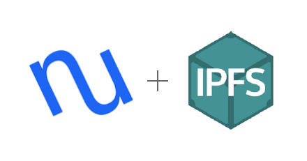

# NCIPFS




[](https://www.python.org/downloads/release/python-370/) [](https://opensource.org/licenses/MIT)


Welcome to ncipfs

this project makes it easy to secure data on IPFS with NuCyphers awesome proxy re encryption.

## Whats that mean?

Basicly this is allows devs to store data in IFPS and create access polices for arbitrary users. 

### Example:  

`David` wants to upload a 1 TB file and allow `Kathy` and `Joe` access. 

Traditionally he would ask `Kathy` and `Joe` for their respecive public keys and then he would encrypt the data twice; once for each key. Then store the encrypted value somewhere they could retrived it. He'll use IPFS as this datastore. 

However NuCyphers proxy re-encryption allows us to encrypt the data once, then re-encrypt new keys that will allow the two parties access. In this system we only encrypt the 1 TB once, and only store 1 TB on IPFS, this saves us storage space, encryption time, and ecryption computations. 

### Benefits

✅ **Y**ou **O**nly **E**ncrypt **O**nce **(Y.O.E.O kinda like Y.O.L.O)**  
✅ Verified (immutable data store)  
✅ Only re-encrypt keys for viewers  
✅ Distributed - no single point of failure  
✅ Can run federated (centralized) or distributed (ECR20 token incentivized)  

### Use cases

💡 Distributing large datasets  
💡 Distributing data to many people  
💡 IOT datastored (check out the original hearbeat example)  

### Implementations

🐥 Python 3 (stable IPFS and NuCypher codebases)  
🥚 Node JS (waiting on stable NyCypher codebase)  
🥚 Golang (waiting on stable NyCypher codebase) 

## Installation
```python
git clone https://github.com/drbh/nucypher-ipfs.git
cd nucypher-ipfs.git
```

We use `pipenv` to manage any of the deps
```
# install deps and access virtual env
pipenv install
pipenv shell
```


## Starting a local NuCypher network

```bash
git clone https://github.com/nucypher/nucypher.git
cd nucypher
pipenv install
pipenv shell
sh scripts/local_fleet/run_local_fleet.sh
```

you should see this if successful
```
Starting Local Development Fleet...
Starting Lonely Ursula...
Starting Ursula #2...
Starting Ursula #3...
```

## How to use the webapp


Make sure your connected to a local nucypher network and a local IPFS gateway (public ones dont allow you to upload photos)

Likely going to need to make your own users to use the demo
```
curl --request POST \
  --url http://127.0.0.1:5000/create_user \
  --header 'content-type: application/json' \
  --data '{
	"name": "example1",
	"password": "12345678901234567890"
}'
```

and another user
```
curl --request POST \
  --url http://127.0.0.1:5000/create_user \
  --header 'content-type: application/json' \
  --data '{
	"name": "example2",
	"password": "12345678901234567890"
}'
```

then grab their public keys and update the `app/src/main.js` file with the users public keys. (will be UI able soon).

## Sharing data with app

Now login to the user in the top left  

You can upload and permission them for the other users to see. You can view the photos or add permissions to them based on the contacts specified your `app/src/main.js` file.

### The NUCID 

We introduce a new concept of a `NUCID` all a NUCID is, is a combination of a NuCypher policy and a IPFS CID. A NUCID specifices alot of information in not tooooo many characters. It have the access policy, the signing key, the humanreadble label and the CID (location and sig of encrypted data)

This all lets you create NUCID's or download data via NUCID's. You can alwayws request a NUCID you don't have access too - you just won't be able to decrypt it. If the policy allows you access, your Bob keys will allow yout to decrypt.

If you login as that user in another window you can access the files you have permission to!
